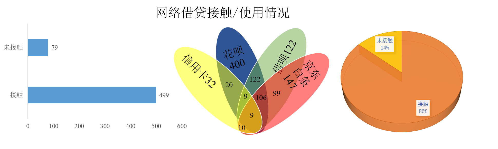

# 中科院学生经济状况数据分析报告

----

## 1. 研究背景

分析中科院研究所同学的消费情况进行了分析统计，支持学生工作办公室制定补贴/学生工资等相关政策的制定。
## 2. 数据管理
### 2.1 调查问卷（设计、回收、数据采集及清洗）
* 从性别、年级、薪资、消费、爱好等多个角度设计中科院学生消费行为问卷：[https://www.wjx.cn/vj/PG43TPk.aspx](https://www.wjx.cn/vj/PG43TPk.aspx)
* 问卷星导出数据，清洗出有效问卷578份，存入 Excel 及 MySQL
### 2.2 数据存储
* 存入 Excel 表[data/info_main.csv](.data/info_main.csv)
* 设计若干数据库表（中科院研究生信息总表、消费行为分表、理财行为分表）

  <font color=green size=3>中科院研究生信息总表: </font>
    
    | 编号 | 性别 | 户籍类型| 年级 | 工资补贴 | 总支出| 其他资金来源 | email|
    | :-----:| :----: | :----: |:-----:| :----: | :----: |:-----:| :----: |
    | 0 | 女 | 城市 |1 | 2100 | 2280 |花呗 | yyyang.shirley@foxmail.com |
    | 1 | 男 | 农村 |1 | 2100 | 1310 |无 |18709280420@qq.com |
    | ... | ... | ... | ... | ... | ... | ... | .... | ... |

  <font color=blue size=3>月平均消费行为表:</font>

    | 编号 | 饮食 |服饰| 彩妆护肤 | 电子产品 | 旅行| 游戏 | 休闲娱乐 |交际|学习资料|
    | :-----:| :----: | :----: |:-----:| :----: | :----: |:-----:| :----: | :----: |:----: |
    | 0 | 800 | 200 |200 | 500 | 180 |0 | 400 | 50|0|
    | 1 | 600 | 100 |10 | 400 | 0 |50 | 100 | 50 |0|
    | ... | ... | ... | ... | ... | ... | ... | .... | ... |

  <font color=blue size=3>理财行为表:</font>

    | 编号 | 每月结余 |理财意向|
    | :-----:| :----: | :----: |
    | 0 | 0 | 基金 |
    | 1 | 790 | 储蓄 |
    | ... | ... | ... |


## 3. 数据汇总

  通过 Python `pymsql`库读取 MySql 数据库信息，对基础信息进行简单的分析汇总并进行展示。

  * 工资金额概况（中位数，分位数，上限，下限，总体数据的变异性和异常值）
    * 箱线图 
    
    

  * 消费金额概况（中位数，分位数，上限，下限，总体数据的变异性和异常值等）
    * 箱线图

    

  * 男女分布情况 
    * 女生312人，男生266人  
    
    

  * 年级分布情况
     * 研一243，研二187， 研三148人
  
    

  * 城乡分布情况
     * 农村256，乡镇175, 城市147人
  
    

  * 主要消费方式分布情况
     * 网购431，线下147
  
    

  * 主要消费支出分布情况
     * 服饰123，饮食 99，旅行38，娱乐123，学习资料56，电子产品86，彩妆护肤42，其他11
    

  * 掌握理财知识统计
     * 了解理财325，不了解253
  
    

  * 接触/使用网络借贷统计(花呗、借呗、京东白条、信用卡)
    * 接触过的人数499，未接触的人数79
    * 接触过人中借贷方式统计：花呗400，借呗123，京东白条147，信用卡32
       
    

  * 每月主要其他经济来源统计
    * 副业62，父母支援123，网络借贷12

    

  * 电子产品消费态度统计
    * 充分享受，有新必换:50
    * 追求实用，满足生活的实际需求:300
    * 极其简单，手机加笔记本满足所有需求:228

    

  * 奢侈品/轻奢消费态度统计
    * 有惯用品牌，喜欢就买:40
    * 渴求，会分期或借钱买:70
    * 感兴趣，偶尔买一个:112 
    * 兴趣不大，购物考虑性价比:348
  
    

  * 游戏消费态度统计
    * 氪金选手:138
    * 偶尔充值:324
    * 白嫖选手:116

    

  * 音乐消费态度统计
    * 看演唱会、听livehouse:78
    * 购买专辑，音乐平台付费:266 
    * 只听免费音乐:234

    
  * 追星情况统计
    * 打投应援追现场:35
    * 不花钱/不关注:543
  
    
  * 化妆/护肤品的品牌和价位统计
    * 海蓝之谜、CPB、娇兰等高档品牌，价位:>2000 23
    * 希思黎、雅诗兰黛、资生堂等中档品牌，价位:500-2000 213
    * 珂润、百雀羚、大宝等普通品牌，价位:<500 342
  
    

  * 手机品牌选择
     
    | 品牌 | 华为 | 小米 | oppo/vivo | 魅族 | 苹果 |other |
    | :-----:| :----: | :----: |:----: |:----: |:----: |:----: |
    | 人数 | 152 | 123 | 78 | 65 | 148 |12  |  
    
    
  * 电脑品牌选择
 
    | 品牌 | 联想 | 戴尔 | 苹果 | 华硕 | 惠普 |other |
    | :-----:| :----: | :----: |:----: |:----: |:----: |:----: |
    | 人数 | 154 | 118 | 59 | 107 | 75 | 65 | 

    


## 4．分析


  本次研究分析针对采集到的 `info_main.csv` 数据集，该数据集
  包括了调查的多个维度，首先简单分析一下 `info_main.csv` 数据集的概况，并对数据集进行初步调整，寻找可值的探索的方向。

### 4.0 加载库
#### 4.0.1 加载数据集

```
import numpy as np
import pandas as pd
import matplotlib.pyplot as plt
import matplotlib
pcon = pd.read_csv("data/info_main.csv")
```

#### 4.0.2 查看数据集行列数

```
print("数据集 {} 共有 {} 行 {} 列".format("data/info_main.csv",pcon.shape[0], pcon.shape[1]))
```

* 该数据集共有 578 行 20 列

#### 4.0.3 查看数据集的列

```
print("数据集 {} 列展示：\n".format(pcon.columns))
```

* 数据集有20列特征，具体解释如下：

    ```
    特征	                   解释
    sex(e)	                性别
    grade  	                年级
    home                    家庭所在地
    salary                  工资
    cost_money              支出
    main_cost_way           主要支出方式
    main_cost_what          主要支出
    other_income            其他经济来源
    economic_pressure       是否有经济压力/焦虑
    dict                    饮食
    luxury                  奢侈品/轻奢
    cream                   护肤品
    electronics             电子产品态度/消费情况
    game                    游戏态度/消费情况
    music                   付费音乐
    star                    追星
    compter                 电脑品牌选择
    phone                   手机品牌选择
    consumer_credit         消费信贷
    financial_habits        理财意识、习惯
    ```

#### 4.0.4 显示调整后的数据集前两行

```
print("前两行为:\n{}".format(pcon.head(2)))
```
  * head 2
    ```
    qwww
    ```

#### 4.0.5 数据质量检查,检查空值
```
print("检查每列的的空值状况:\n{}".format(pcon.isnull().any()))
#pcon[pcon['xx'].isnull()] #检查某一colum缺值情况
```
  * 问卷设计中有提交检查，并且在清洗存入Excel、MySQL时进行了清洗，故没有空值。
      
    ```

    特征	                 解释
    sex(e)                  false
    grade  	                false
    home                    false
    salary                  false
    cost_money              false
    main_cost_way           false
    main_cost_what          false
    other_income            false
    economic_pressure       false
    dict                    false
    luxury                  false
    cream                   false
    electronics             false
    game                    false
    music                   false
    star                    false
    compter                 false
    phone                   false
    consumer_credit         false
    financial_habits        false
    ```

### 4.1 收入分析
* 工资补贴最小值1600元，最大值6000元，平均值xx元，中位数xx，标准差xx
#### 4.1.1 工资分析（年级）
> 分析方法：单因素方差分析

<details>
    <summary>Python code（单因素方差分析年级对工资的影响）</summary>

  ```python
  from statsmodels.stats.multicomp import MultiComparison
  mc = MultiComparison(df_melt['salary'],df_melt['grade'])
  tukey_result = mc.tukeyhsd(alpha = 0.5)
  print(tukey_result)
  ```
</details>


* 一年级：1600-3000  
* 二年级：2300-5600 
* 三年级：2800-6000

结论：

* 各年级有显著性差异（p<0.05），研一、研二和研三呈递增关系。
#### 4.1.2 工资分析（性别）
>分析方法：单因素方差分析

<details>
    <summary>Python code（单因素方差分析性别对工资的影响）</summary>

  ```python
  from statsmodels.stats.multicomp import MultiComparison
  mc = MultiComparison(df_melt['salary'],df_melt['sex'])
  tukey_result = mc.tukeyhsd(alpha = 0.5)
  print(tukey_result)
  ```
</details>


* 男：1600-6000，女：1600-5980

结论：
* 各组间无显著性差异（p>0.05），可以认为工资分布与性别无关
#### 4.1.3 工资分析（城乡）
>分析方法：单因素方差分析

<details>
    <summary>Python code（单因素方差分析城乡分布对工资的影响）</summary>

  ```python
  def findDuplicate(nums):
      slow = 0
      fast = 0
      while True:
          slow = nums[slow]
          fast = nums[nums[fast]]
          if slow == fast:
              break
      find = 0
      while True:
          find = nums[find]
          slow = nums[slow]
          if find == slow:
              return find
  ```
</details>


* 城市：1750-5870，乡镇：1600-5880，乡村：1700-6000

结论：
* 各组间无显著性差异（p>0.05），可以认为工资分布与城乡差异无关

#### 4.1.4 其他收入构成（家庭、理财、兼职、副业，奖学金）
>分析方法：描述性统计分析


<details>
    <summary>Python code（其他收入构成分析）</summary>

  ```python
  def findDuplicate(nums):
      slow = 0
      fast = 0
      while True:
          slow = nums[slow]
          fast = nums[nums[fast]]
          if slow == fast:
              break
      find = 0
      while True:
          find = nums[find]
          slow = nums[slow]
          if find == slow:
              return find
  ```
</details>


结论：
* 共533人有其他收入，主要其他收入来源为家庭77，奖学金149，副业59，兼职85，理财43，信用卡、花呗等120人
* 有其他收入的学生中，来自于城市的学生占26.3%，主要其他收入来源为家庭和副业（饼图：）
* 来自乡镇的学生占32%，来自农村的学生占41.7%，主要其他收入来源为奖学金（饼图）
* 其他收入来源为副业和理财的学生占比很低
* 其他收入主要来源为奖学金的学生占比随年级数增加逐年增高，研二、研三与研一相比明显增多，推测原因为：研二和研三时学术成果较多，可以申请到较高额奖学金。
* 女生其他收入来源排名前三为奖学金、家庭、副业，男生其他收入来源排名前三为奖学金、家庭、理财。（饼图）

### 4.2 支出分析
* 月平均支出最小值900元，最大值6400元，平均值xx元，中位数xx元，标准差xx
#### 4.2.1 性别
>分析方法：

结论：（折线图对比）
* 月平均支出范围：女生1200-6400元，男生900-6200元
* 女生的主要消费支出占比（服饰24%、护肤彩妆18、娱乐22、饮食13、电子产品9.5、旅行7、学习资料11、其他2）
* 男生的主要消费支出占比（电子产品21、饮食21、服饰17.5、娱乐18.9、护肤彩妆9.3、旅行6.7、学习资料8.3、其他2）
* 对比发现女生对护肤彩妆的兴趣大于男生，男生对电子产品的兴趣大于女生。
* 将饮食作为主要支出的占比，男生大于女生。
#### 4.2.2 年级
>分析方法：

结论：（折线图对比）

* 一年级900-4600元，主要消费支出占比（服饰15%，饮食 23，旅行9.3，娱乐19，学习资料11.3，电子产品18，彩妆护肤4，其他0.5）
* 二年级1400-5900元，主要消费支出占比（服饰22，饮食 15，旅行4，娱乐24.2，学习资料13.5，电子产品11.9，彩妆护肤7.3，其他2）
* 三年级1620-6400元，主要消费支出占比（服饰29.5，饮食 9.8，旅行7，娱乐20.3，学习资料3.6，电子产品14，彩妆护肤11.5，其他4.4）
* 二年级与一年级相比，电子产品占比下降33.9%，服饰上升46.7%

#### 4.2.3家庭所在地
结论：
* 月平均支出范围：城市学生2200-6400元，乡镇学生1200-6000元，农村学生900-6200元
* 相较于乡镇和农村，城市学生平均月支出更高
* 城市中，女生平均支出高于男生；农村中，男生平均支出高于女生；乡镇基本持平 
* 城市学生主要支出在电子产品、娱乐、旅行上的占比高于乡镇和农村学生


### 4.3 超前消费维度的分析


  > 在分析中认为当满足1.支出大于工资，2.其他资金来源为信用卡、花呗等借贷方式两个条件时，该生有超前消费行为。

#### 4.3.1 男女比例
>分析方法：皮尔逊相关性分析

结论：女生78人，男生37人
* 超前消费习惯与性别具有相关性
* 女性更容易有透支性消费行为

#### 4.3.2 年级比例
结论：研一69，研二15，研三31
* 研一学生超前消费的比例更高，研三其次，研二较少
* 对有超前消费行为的学生主要支出进行分析，主要分布在电子产品、娱乐

#### 4.3.3 家庭所在地
结论：城市63，乡镇21，农村31
* 城市学生更易超前消费，农村次之，乡镇最少
* 对有超前消费行为的学生主要支出进行分析，主要分布在娱乐、服饰

#### 4.3.4 综合分析
结论：
* 具有超前消费行为学生共115人，占总人数19.90%
* 具有超前消费行为的学生，主要支出占比最大的为娱乐
* 研一超前消费学生家庭所在地为城市的占比较大，研三超前消费学生家庭所在地为农村的占比较大
* 研一、研二及研三，超前消费学生中女生占比均高于男生

#### 4.3.5 超前消费对正常生活的影响
结论：
* 超前消费学生中，影响正常生活为42人，没有影响为73人
* 影响正常生活的学生主要支出为娱乐，没有影响正常生活的学生主要支出为电子产品
* 影响正常生活的学生主要家庭所在地为城市的占比较大

### 4.4 理财意识分析

#### 4.4.1 男女比例
>分析方法：皮尔逊相关性分析
结论：女生179人，男生99人
* 理财意识与性别具有相关性
* 女性有理财意识的比例更高

#### 4.4.2 年级比例
结论：研一42，研二86，研三150
* 研三学生有理财意识的比例最高，研二其次，研三较少
#### 4.4.3 家庭所在地
结论：城市156，乡镇50，农村72
* 城市学生更具有理财意识，乡镇次之和农村占比持平


## 5. 拓展/思考
- 对区域经济的影响
- 周边实体经济的影响
- 可推广的商业模式


